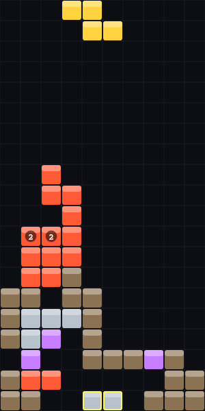

# SuperCube（Web/TS 版）

基于《俄罗斯方块》的元素 PVP 手游 —— 自定义棋子 + 元素化学反应 + 动态天气 + 同屏回合制抢分。本仓库是从原 Unity 工程迁移到 **TypeScript + HTML5 Canvas** 的可玩 MVP 原型，可在云端全自动编译 / 测试 / 构建，后续可用 Capacitor 打包成 iOS / Android App。

设计依据见 [`SPEC.md`](./SPEC.md)（由原《游戏大纲》GDD V3.0 提炼）。



## 快速开始

```bash
cd SuperCube-Web
npm install
npm run dev       # 本地开发，浏览器打开提示的地址（手机/桌面均可）
npm test          # 运行 30 个单元测试
npm run build     # 产出 dist/ 静态包，可直接部署
npm run preview   # 预览生产构建
```

操作：键盘 `←→` 平移、`↑` 旋转、`↓` 软降、`空格` 落子；触屏用底部按钮。

## 已实现（MVP / P0）

- **同屏回合制对战**：10×20 公共棋盘，A（你）/ B（AI）交替落子，谁触发消除分归谁（抢分截胡）。
- **源力工坊棋子设计器**：4×4 画布，最多 4 块，**至少一个角相连（含对角线）** 的校验；元素调色盘；陈列滚轴（上限 9 枚），铸造的棋子直接进入对战牌库。
- **元素化学反应矩阵**（边相邻触发、3 回合延时）：火蔓延、火+水湮灭、水催生木（晴天翻倍）、水+带电金属 3×3 爆炸、金属下压、雷暴使生命退化、冰遇水变水、冰滑动、粘粘悬停、生命方块远古清屏。
- **计分系统**（GDD 铁律）：元素反应零分；基础消除 1/2/4/8/16；连锁 ×2/×4/×8；远古生命海量积分。
- **动态天气系统**：晴/雨/雪/雷暴/火山，每 5 回合切换，**预报有概率报错**坑人。
- **AI 对手**：评估落点（消行、高度、空洞、起伏），三档难度。
- **生存竞技模式**：触顶即死。

## 架构

```
src/
  core/        纯逻辑（无 DOM，可单测）
    types.ts       元素 / 棋子 / 天气 类型
    grid.ts        10×20 棋盘、重力、消行
    pieces.ts      7 基础棋子 + 自定义棋子校验（顶点相连）
    reactions.ts   元素化学反应矩阵（核心）
    weather.ts     天气系统 + 不可靠预报
    scoring.ts     计分规则
    rng.ts         可种子化随机（可复现）
    engine.ts      回合循环 / 落子 / 连锁 / 胜负
  ai/ai.ts     AI 评估与决策
  ui/          Canvas 渲染 + 大厅/对战/工坊界面
tests/         30 个单元测试（逻辑 + AI）
```

逻辑与渲染彻底分离：`core/` 全部是纯函数，可在 Node 里跑测试与 AI 自对弈压测（已验证 30 局 6000 回合零崩溃）。

## 待办（后续阶段）

- **P1**：限时狂欢模式、Loadout 15 秒暗牌博弈（给对手塞 Debuff 棋子）、源力图鉴 Codex、出炉动画与音效。
- **P2**：真实联网 PVP + 匹配服务器、肉鸽 PVE（守门员 + 变异遗物）、源力碎片养成、Capacitor 打包上架。

## MVP 取舍说明

为保证 MVP 稳定可玩，部分 GDD 细节做了简化：天气的"1 回合后生效"延时按"持续生效"处理；冰滑动按落地后单格滑动实现；水催生顶起的 RNG 判定为固定概率。这些都在 `core/` 中集中，便于后续逐条精确化。
